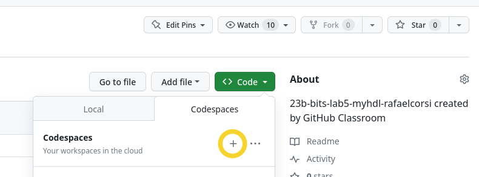

# Lab MyHDL

| Descritivo                                                                     |
|--------------------------------------------------------------------------------|
| Pontos: {{lab_myhdl_points}}
| Fazer em dupla!                                                                |
| Accessar pelo: [Classroom]({{lab_myhdl_classroom}}){.ah-button} |

!!! info "💰 Laboratório com pontos"
    ==Realizar em dupla!==. Para os dois ganharem os pontos todos devem acessar o classroom com a sua respectiva conta do github! Mesmo sendo em dupla, sugerimos para todos fazerem, pois esse tipo de exercício vai ser cobrado em quiz.

!!! exercise
    Antes de seguir, leia a teoria desta aula.

Este laboratório é introdutório para o desenvolvimento do projeto ([`Lógica-Combinacional`](/bits-e-proc/class/logiComb-Projeto)), onde iremos criar componentes de hardware que serão os alicerces do nosso computador. Primeiro precisamos praticar um pouco de `MyHDL` e entender a ferramenta e o fluxo de compilação, teste e como conseguimos executar o hardware em uma FPGA.

==Os laboratórios são individuais e possuem nota (atualizado para a nova versão do curso)==, cada laboratório contribui com um pouco dos pontos da avaliação individual. Todos os laboratórios devem ser realizados localmente e finalizados até o término da aula.

## Infra

Agora iremos fazer todo o desenvolvimento da disciplina usando o codespaces:

1. Crie o repositório pelo link do [Classroom]({{lab_myhdl_classroom}})
1. Com o repositório criado, clique em  [Code -> Codespace]()[^1]
1. Aguarde carregar e abrir o `vscode` online
1. Trabalhe online

[^1]: 

!!! video
    

### pytest

Bits e Processadores utiliza uma metodologia de desenvolvimento de projeto chamada de **test driven development (TDD)**, ou seja, para cada etapa do projeto teremos um teste associado a ele. Os testes podem ser do tipo unitário e de integração. Para realizarmos os testes em python utilizaremos o módulo `pytest` e o plugin de dev-life (para fazer o report do progresso de vocês para o servidor).

Cada exercício possui um arquivo com o prefixo `test_` que excita o componente que vocês irão desenvolver e valida a saída esperada.

A seguir um exemplo do teste falhando e então solucionado e testado novamente:

<script id="asciicast-DL3cuBQSgSgIyXdZK2LVBolgr" src="https://asciinema.org/a/DL3cuBQSgSgIyXdZK2LVBolgr.js" async></script>

!!! exercise
    Execute no terminal `pytest -s -k exe1`
    
    O teste deve falhar pois não foi implementado ainda.
    
    Edite o arquivo `comb_modules.py` com a lógica a seguir:
    
    ```diff
    def exe1():
    -    pass
    +    q.next = a or (not b)
    ```
    
    Execute o `pytest -k exe1` novamente e note que o código passa no teste.
    
!!! progress
    Começando o laboratório.
    
## Praticando

Agora é por sua conta, você deve descrever alguns circuitos lógicos combinacionais bem simples em MyHDL. 

!!! exercise "💰 1 ponto - até o final da aula"
    Para cada exercício implemente a solução no arquivo `comb_modules.py` e teste com `pytest`. A descrição do exercício está no próprio módulo.

    - `pytest -s -k exe2`
    - `pytest -s -k exe3`


## Testando no hardware

Faća o download do programa que facilita a programacão da FPGA (desenvolvido internamente pelo Eduardo Marossi):

- https://github.com/Insper/fpgaloader/releases

E com a FPGA plugada no computador execute o programa.

!!! warning "Usuários Windows"

    Vocês vão precisar baixar também o programa Zadig (está também no github, em releases). Executem o Zadig, e pluguem a placa, deverá aparecer "USB Blaster II", escolha o driver "libusb-K" conforme a imagem e clique em "Install Driver". Em seguida pode prosseguir abrindo o programa "fpgaloader"


    
!!! warning "Usuários macOS (M1/M2 ou Intel)"

    Baixem a versão apropriada para o seu macOS, se você tem M1 ou M2 baixe a versão aarch64. Caso seja Intel baixe a versão x86_64. Descompacte e arraste o aplicativo fpgaloader para pasta Applications no seu macOS. Para abrir a primeira vez, será necessário clicar com o botão direito do mouse em cima do executável, e clicar em "Abrir".


!!! warning "Usuários Linux"
    Executem o comando com `sudo` por conta do acesso ao USB.


### Executando na FPGA 
    
!!! video
    

Agora vamos entender como conseguimos usar o nosso hardware descrito em `MyHDL` em um hardware real (FPGA), para isso temos que primeiro converter o `MyHDL` para `VHDL` e então usar a ferramenta da Intel (Quartus) para **sinterizar** o nosso hardware. Depois disso temos que programar a FPGA, a seguir temos uma visão simplificada do fluxo:

```
   toplevel.py   ---> toplevel.v ---> yosys ---> .rbf ---> FPGA
       ^                                  
       |                                   
    componente.py                        
```

Notem que agora o nosso módulo precisa ler e acionar pinos (interface com o mundo externo), normalmente a última camada de um projeto de hardware (aquela que realmente acessa os pinos) é chamada de toplevel. Os pinos dessa camada possuem nomes fixos, por isso temos que mapear os pinos do HW para os sinais do nosso módulo. Nessa primeira etapa iremos utilizar os seguintes componentes da nossa placa:


Onde:

- `LED`: 10 leds que acendem com lógica `1`
- `Push Buttons`: 4 botões que quando apertados fornecem lógica `0`
- `Slide Switchs`: 10 Slides que quando acionados forcem lógica `1`
- `HEX Displays`: 6 displays de 7 segmentos (anodo comum)

### Gerando `toplevel.vhd`

O programa `toplevel.py` faz o mapeamento do componente para os pinos da FPGA e gera o arquivo `toplevel.vhd` que será utilizado pelo Quartus para gerar o arquivo binário que irá ser programado na FPGA, a ideia desse módulo é mapear os sinais do componente para nomes e tamanhos fixos que serão utilizados pelo programa.

```py title="toplevel.py"
@block
def toplevel(LEDR, SW, KEY, HEX0, HEX1, HEX2, HEX3, HEX4, HEX5, CLOCK_50, RESET_N):
    ...
    
    ic1 = exe4(ledr_s, SW)
    
    ...

# pinos
LEDR = Signal(intbv(0)[10:]) # (1)
SW = Signal(intbv(0)[10:])
KEY = Signal(intbv(0)[4:])
HEX0 = Signal(intbv(1)[7:])
HEX1 = Signal(intbv(1)[7:])
HEX2 = Signal(intbv(1)[7:])
HEX3 = Signal(intbv(1)[7:])
HEX4 = Signal(intbv(1)[7:])
HEX5 = Signal(intbv(1)[7:])

# instance e generate vhd
top = toplevel(LEDR, SW, KEY, HEX0, HEX1, HEX2, HEX3, HEX4, HEX5)
top.convert(hdl="verilog") #
```

Notem que os sinais criados são do tipo `Signal(intbv(0)[X:])`, isso indica que estamos manipulando um vetor de bits de tamanho **X**, no caso do LED, indicamos que o vetor é do tamanho 10, e no caso das KEY de tamanho 4. Com isso, podemos dentro do componente acessar individualmente cada um dos elementos do vetor:
 
 ```py title="comb_modules.py"
 @block
 def exe4(led, sw):
    @always_comb
    def comb():
        led[0].next = sw[0] and (not sw[1])

 return instances()
 ```
    
!!! info
    Notem que o `componente` recebe como argumentos os `ledr_s` e as chaves `SW` da FPGA e implementa a lógica `sw[0] and (not sw[1])`.

### Gerando `.rbf`

O processo de gerar um hardware que posso ser executado na FPGA é complexo e até pouco tempo não existiam ferramentas opensource que fazem isso. Iremos utilizar uma série de softwares opensource que realizam a síntese do nosso projeto para algo que possa ser programado na FPGA.

!!! tip
    O processo é demorado para quem está acostumado a apenas programar em python, a geracão do arquivo pode demorar um pouco mais.

!!! exercise
    Na raiz do repositório execute:
 
    1. `make toplevel.rbf`
    1. Aguardem compilar
    1. Verifiquem que um novo arquivo `toplevel.rbf` foi gerado
    
### Programando FPGA

Agora com a FPGA plugada no computador podemos programar, para isso basta abrir o programa `fpgaloader` e arrastar o arquivo `toplevel.rbf` para o programa. 

!!! exercise
    1. Gere o `toplevel.rbf`
    1. Faća o download do arquivo
    1. Usando o `fpgaLoader` programe a FPGA
    1. Mexa nas chaves 0 e 1 e notem o LED 0 obedece a equacao `sw0 and (not sw1)`
    
## Praticando - parte 2

Vamos praticar um pouco mais, agora usando a FPGA. Para cada um dos módulos a seguir, implemente o MyHDL e então execute na FPGA.

!!! exercise 
    - Modulo: `exe5`
    
    Tarefa: 
    
    1. Implementar o módulo
    1. Edite o `toplevel` para incluir o `exe5`
    1. Compile o verilog
        - `make toplevel.rbf`
    1. Programe a FPGA 
    1. Valide 
    
    Dica: 
    
    Você não pode ler uma saída `led[1].next = not led[0]`, para isso criei uma variável auxiliar:
    
    ```py
    led0 = sw[0]
    leds[0].next = led0
    leds[1].next = not led0
    ```

!!! exercise "💰 2 pontos"
    - Modulo: `sw2hex`
    
    Modifique o `toplevel.py` adicionando o módulo novo para acionar o `HEX0` controlado pelo `sw2hex`:
    
    ``` diff
    ic1 = exe5(ledr_s, SW)
    +ic2 = sw2hex(HEX0, SW)
    ```
    
    Isso fará com que o módulo `sw2hex` controle os pinos do display de 7 segmentos que temos na FPGA, você deve mudar o valor das chaves e observar se o display exibe o valor correto (as chaves da FPGA vão ser tratadas como um valor binário).
    
    1. Valide na FPGA, seguindo todos os passo anteriores.
    1. Agora termine de implementar o módulo
