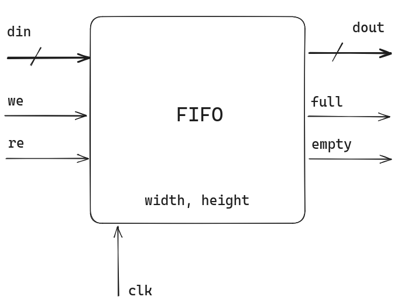
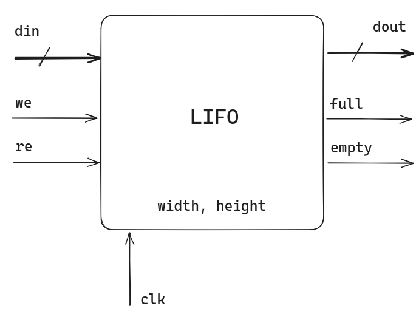

# 3 - Lógica Sequencial

| Deadline: {{proj_seq_deadline}}                                                |
|--------------------------------------------------------------------------------|
| [Classroom]( {{proj_seq_classroom}})                                           |
| ^^AO FINAL:^^ Preencher para entregar [==Mediador==]( {{proj_forms_mediador}}) |
| ^^AO FINAL:^^ Preencher para entregar [==Dev==]( {{proj_forms_dev}})           |


Neste projeto você terá que desenvolver os componentes síncronos que serão utilizados na construção do nosso computador Z01.

## Instruções 

!!! exercise "Começando novo projeto"
    O grupo deve escolher um novo mediador para o projeto (não pode repetir) e os demais integrantes serão desenvolvedores.

    - Você é o mediador do projeto? Leia: [Vixi sou mediador](/bits-e-proc/util/Util-vixi-sou-scrum)
    - Seu papel é o de desenvolvedor? Leia: [Vixi sou dev](/bits-e-proc/util/Util-vixi-sou-dev/)

    Para o desenvolvimento do projeto iremos usar o codespace (todos devem fazer), como vamos estar trabalhando em grupo no mesmo repositório, devemos criar um workspace por aluno, siga os passos em:

    - [github codespace](/bits-e-proc/util/Util-projeto-codespace)

## Instruções 

Os arquivos referentes ao projeto são:

- `hw/seq.py`: Script python com os módulos a serem implementados
- `hw/test_seq.py`: Script de teste 

### Executando o Script de Teste 

Abra o terminal na pasta `hw` execute o pytest:

```bash
$pytest -s test_seq.py 
```

!!! tip
    Você pode usar o `-k MODULO` para executar apenas o teste o do módulo que deseja, exemplo (para testar o PC):
    
    ```bash
    pytest test_seq.py -s -k pc
    ```

## Projeto

O projeto consistem em:

- Implementar os módulos descritos a seguir.
- Para cada módulo vocês devem gerar uma forma de onda `vcd` e salvar na pasta `hw/waveform`
- Analisar a forma de onda gerada 
    
### Módulos 

Os modulos a serem desenvolvidos na entrega estão detalhados no livro base do curso: [**Capítulo 3 - The Elements of Computing Systems**](https://docs.wixstatic.com/ugd/44046b_862828b3a3464a809cda6f44d9ad2ec9.pdf)

- `dff(q, d, clear, presset, clk, rst)`
- `binaryDigit(i, load, output, clk, rst)`
- `register8(i, load, output, clk, rst)`
- `registerN(i, load, output, width, clk, rst) `
- `pc(increment, load, i, output, width, clk, rst)`
- `ram(dout, din, addr, we, clk, rst, width, depth)`

---------------------------

- Flip-flop
   - **Módulo:** `dff(q, d, clear, presset, clk, rst)`
   - **Dependência**:
   - **Test:** `pytest test_seq.py -k dff`
   - Módulo já implementado.
 


---------------------------

- Binary Digit
    - **Módulo**: `binaryDigit(i, load, output, clk, rst)`
    - **Dependência**: `dff` 
    - **Descrição** : É um registrador feito para armazenar um único bit de informação (0 ou 1). A interface do módulo consiste em uma entrada (d) para o bit a ser armazenado, um sinal de **load** para indicar quando o bit de entrada deve ser armazenado um sinal de *clock* e a saída *output** que é o bit armazenado:
    
{width=500}
    
---------------------------

- Register 8
    - **Módulo**   : `register8(i, load, output, clk, rst)`
    - **Dependência** : `binaryDigit`
    - **Descrição** : É um registrador de 8 bits criado a partir do `binaryDigit` porém agora para armazenar um vetor de entrada de 8 bits de tamanho.
    

    
---------------------------

- Register N
    - **Módulo**   : `registerN(i, load, output, width, clk, rst) `
    - **Dependência** : `binaryDigit` (ou register8)
    - **Descrição** : É um registrador de N bits criado a partir do `binaryDigit` porém agora para armazenar um vetor de entrada de N bits de tamanho.
    
---------------------------

- Program Counter
    - **Módulo**   : `pc(increment, load, i, output, width, clk, rst)`
    - **Dependência** : `registerN` (pode usar `inc16`, `mux`)
    - **Descrição** : O program counter será o nosso endereçador de memória da CPU, ele será responsável por apontar para a próxima instrução a ser executada. Como normalmente um código segue um fluxo sequencial (uma linha na sequência da outra) o PC possui a habilidade de se auto incrementar a cada clock (apontando assim para  a próxima instrução), mas ele tem que suportar **condições** (if, while, ...) rompendo com esse fluxo contínuo.
 
> Para maiores detalhes consulte o livro texto do curso.   

---------------------------

- ram
    - **Módulo**   : `ram(dout, din, addr, we, clk, rst, width, depth)`
    - **Dependência** : `RegisterN` (pode depender de `mux`, `demux8`)
    - **Descrição** : É uma memória de 8 endereços com 16 bits de largura. O componente possui como entrada o vetor input de 16 bits, o endereço a ser armazenado (address) o sinal **load** que indica quando é para ser armazenado e o clock. Como saída temos o valor lido no endereço especificado quando load for igual a 0.
     Note que sinal LOAD tem como função similar o do READ/WRITE, quando zero, indica que queremos ler o valor armazenado, quando 1 indica que queremos escrever (write) nessa posição.
     
     - `width`: É a largura dos dados da memória RAM
     - `depth`: É a quantidade de endereços que a memória possui
    

 
!!! tip
    Todos esses módulos estão bem documentados no livro The Elements of Computer System. Cap 3.
 
### Forma de onda

Para cada teste realizado, deve-se carregar o `vcd` e tirar um **print** da forma de onda do módulo com os testes aplicados a ele. Essa imagem deve ser salva na mesma pasta `hw/waveform/` e com o mesmo nome dos módulos. 

!!! warning
    Não basta só gerar a imagem, você precisa analisar e entender. Isso será cobrado nas avaliações.

### Projeto

| Conceito |                                                                  |
|----------|------------------------------------------------------------------|
| B        |                                                                  |
| C        | Todos os módulos testados no github actions                      |
|          | Todos os módulos básicos passam nos testes                       |
|          | Vídeo explicando os módulos                                      |
| D        | Ao menos um módulo não foi implementando ou não passa no testes. |
| I        | Menos da metade dos módulos funcionando                          |

## C

!!! info
    Atualizar o README.md do repositório com o link para os vídeos!

Para o conceito C o grupo (um módulo por integrante) deve escrever um pequeno descritivo no `README.md` do repositório contendo uma breve explicacão de que como cada um dos módulos foram desenvolvidos e para que eles funcionam. Para cada módulo vocês devem escrever:

1. Para que serve o componente
1. O diagrama (`hardware`) do módulo (pode fazer no drawio) 
1. A forma de onda da simulacão (`vcd`) explicada

## B

Aqui vocês devem gravar um pequeno vídeo explicando cada módulo, o vídeo de no máximo 4min por módulo deve possuir:

1. Para que serve o componente
1. O `MyHDL` que descreve o módulo
1. O diagrama (`hardware`) do módulo (pode fazer no drawio) 
1. A forma de onda da simulacão (`vcd`) explicada

Atualizar o `README` adicionando o vídeo.

## A

Vamos estudar mais alguns componentes muito utilizados em sistemas digitais para armazenamento de dados, para cada componente vocês devem escrever uma pequena secćão no `README` e gravar um vídeo explicando:

1. Para que serve
1. Um diagrama `hardware` do módulo (entrada e saída, pode ser tipo "caixa preta")

Os componentes a serem estudados são:

- FIFO: First-in First-out (`FIFO`)
- LIFO: Last-in First-out (`LIFO`) 
- Shift Register

## A


<!--

Para testar utilize a FPGA e o `toplevel.py` fornecido de exemplo, cada módulo deve ser testado na FPGA e um vídeo explicativo gravado (com um diagrama de blocos, o myhdl e o hardware funcionando).

### FIFO

First-in First-out (`FIFO`) é um componente que implementa uma FILA, onde o primeiro dado salvo é o primeiro dado a ser lido. Este componente é muito utilizado para armazenamento de dados e pós processamento. Uma FIFO pode ser implementada tanto em `hw` quando em `sw` (no python você pode usar `queue`).$pytest

!!! video
    

A nossa FIFO vai possuir os seguintes sinais de entrada e saída:

```py
def fifo(dout, din, we, re, empty, full, clk, rst, width, depth):
```

Onde:

- `din`: Entrada, dado a ser armazenado
- `dout`: Saída, dado lido 
- `we`: Entrada, se `1` a operacão é de armazenamento 
- `re`: Entrada,  se `1` a operacão é de leitura 
- `empty`: Saída, se `1` a FIFO está fazia
- `full`: Saída, se `1` a FIFO está cheia

O módulo possui os seguintes valores de configuraćão:

- `width`: Largura do dado a ser armazenado
- `height`: Quantidade de dados possíveis na fila



### LIFO

Last-in First-out (`LIFO`) é um componente que implementa uma PILHA, onde o primeiro dado salvo é o ==ultimo== dado a ser lido. Este componente é muito utilizado para armazenamento de dados e pós processamento. Uma FIFO pode ser implementada tanto em `hw` quando em `sw`.


A nossa LIFO vai possuir os mesmo sinais da FIFO:

```py
def fifo(dout, din, we, re, empty, full, clk, rst, width, depth):
```



Onde:

- `din`: Entrada, dado a ser armazenado
- `dout`: Saída, dado lido 
- `we`: Entrada, se `1` a operacão é de armazenamento 
- `re`: Entrada,  se `1` a operacão é de leitura 
- `empty`: Saída, se `1` a LIFO está fazia
- `full`: Saída, se `1` a LIFO está cheia

O módulo possui os seguintes valores de configuraćão:

- `width`: Largura do dado a ser armazenado
- `height`: Quantidade de dados possíveis na fila
-->
